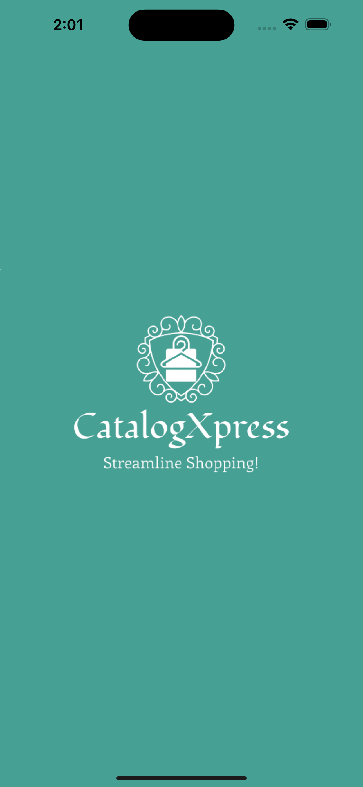
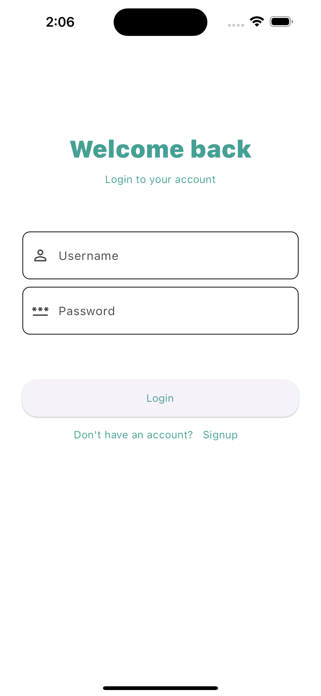
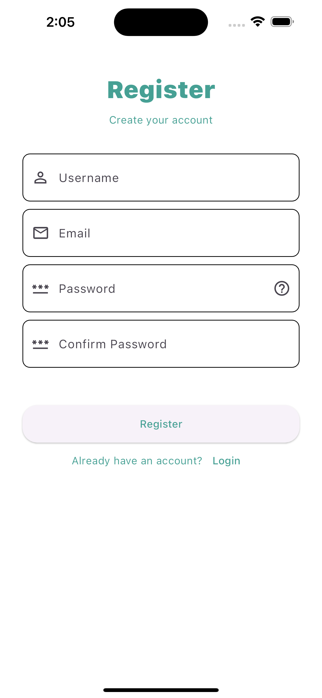
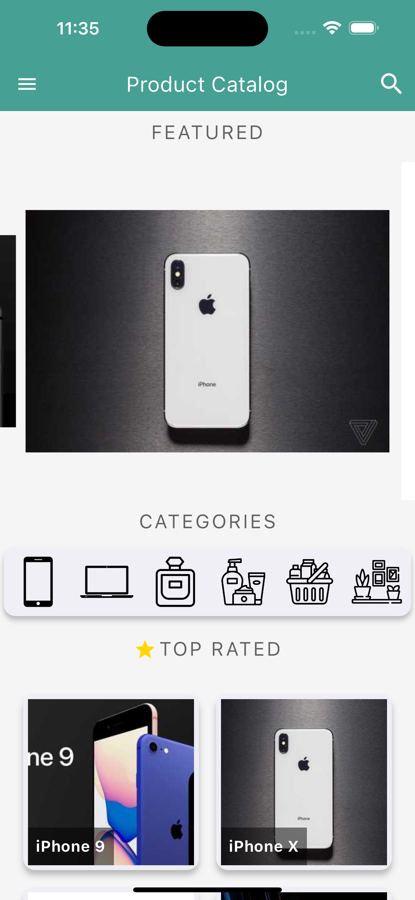
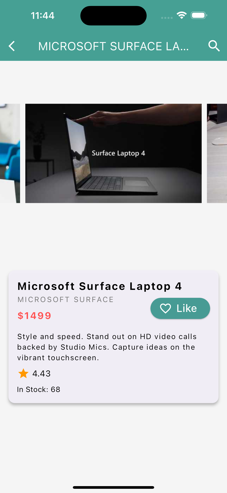
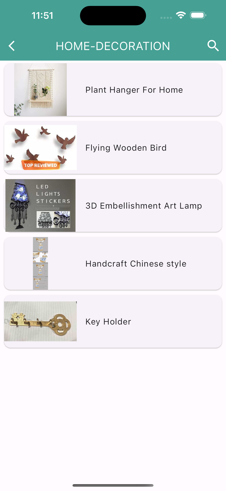
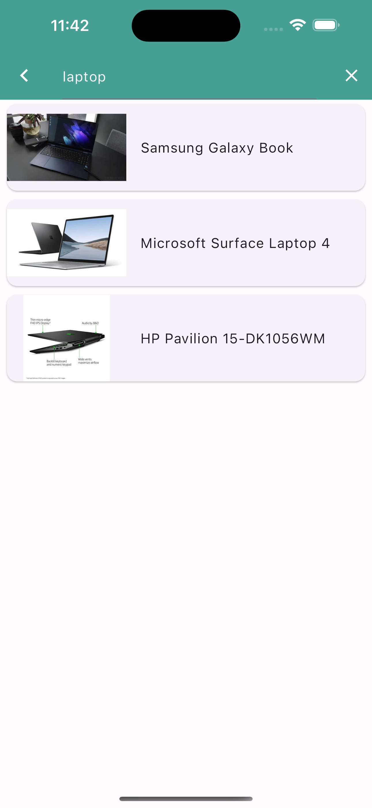
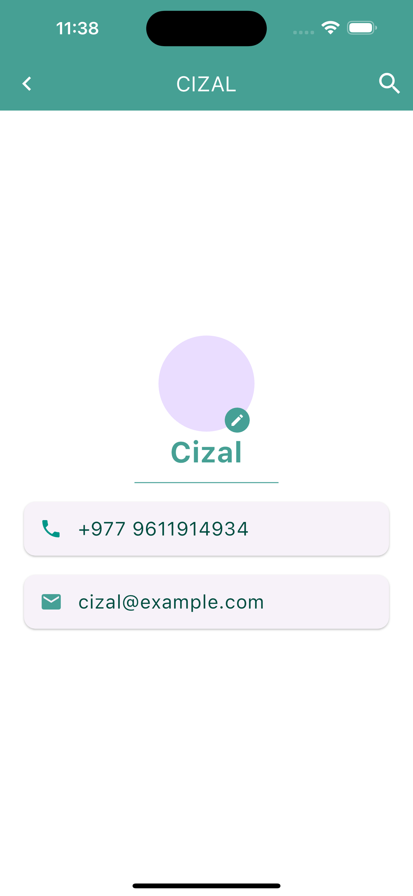
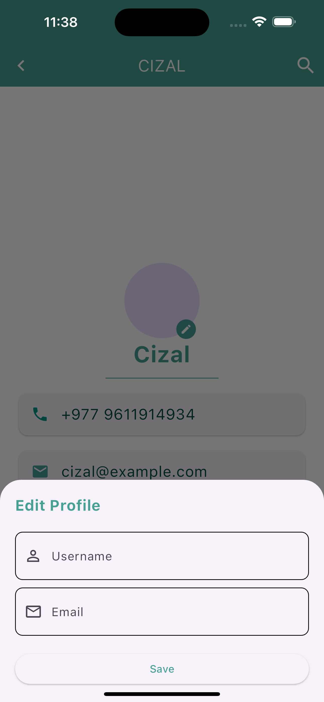

# CatalogXpress - a Product Catalog app
# App UI

## Screens
1. Splash Page

2. Login Page

3. Register Page

4. Home Page

5. Product Details Page

6. Category Page

7. Search Page

8. User Details Page

### Splash Screen
- Enhanced initial user experience with a visually appealing loading screen.

### Home Page
- Features three custom widgets: Carousel, GridView, and CategoryRail.
- Provides an interactive and informative user experience.
- Carousel and GridView showcase product thumbnails.
- CategoryRail offers quick navigation to respective category pages.

### Product Details Page
- Displays all relevant information about the selected product.

### Category Page
- Displays a list of products related to the selected category.

### User Details Screen with Edit Modal
- Users can view and manage their profile information.
- Modal allows users to edit details conveniently, including name, email, profile picture, and other relevant information.

### Search Page
- Allows users to search for products using specific keywords.
- Displays a list of products relevant to the search query.

### Persistent AppBar and Drawer
- The AppBar and Drawer are persistent across all screens for consistent navigation.

### Authentication
- Login Screen and Register Screen for user authentication.
- Users can log in or create an account for personalized features and information.

### Toast Notifications
- Integrated toast notifications for providing feedback and information during registration and login processes.

# App Logic

## Data Fetching and Product Handling

1. Product data fetched from Dummy JSON API in JSON format.
2. Fetched data parsed into a Dart Map for data structure methods.
3. Custom Product class created to represent product information.
4. Fetched and parsed data utilized across different app pages.
5. App navigates users to the Product Detail page when clicking on a product.

## Frontend 

## User Registration and Login
1. Users provide username, email, password, and confirm password.
2. Frontend validation ensures all required information is entered.
3. Completing all fields and matching passwords is required.
4. Login only requires username and password.
5. Information sent as an HTTP request to backend for processing.

## Backend 

## User Authentication

### User Routes
- Distinct routes for user login and registration.

### Database
- Connected to MongoDB Atlas, a cloud-based database.

### Validation
- Backend performs validation checks, including unique usernames, emails, and password strength.
- Regular Expressions used for email and password validation.

### Responses
- Server sends responses to the client with status codes and success/error messages.

## User Data Management

### Get User Data Route
1. Route to retrieve user data based on the user's unique identifier.
2. Backend queries the database to find user information associated with the userName.
3. If found, the server sends a response with user data, including username and email.

### Update User Data Route
1. Route for users to update their profile information.
2. Users send a request with userId and updated information.
3. Server performs validation checks on updated data.
4. If data is valid, the server updates user information in the database.
5. Server sends a response with a success message or status code to confirm the update.

------

This combined description provides an overview of how data is handled, user registration and login processes are managed on the frontend, and user authentication is handled on the backend to create a functional and secure app.

## Getting Started

This project is a starting point for a Flutter application.

A few resources to get you started if this is your first Flutter project:

- [Lab: Write your first Flutter app](https://docs.flutter.dev/get-started/codelab)
- [Cookbook: Useful Flutter samples](https://docs.flutter.dev/cookbook)

For help getting started with Flutter development, view the
[online documentation](https://docs.flutter.dev/), which offers tutorials,
samples, guidance on mobile development, and a full API reference.
